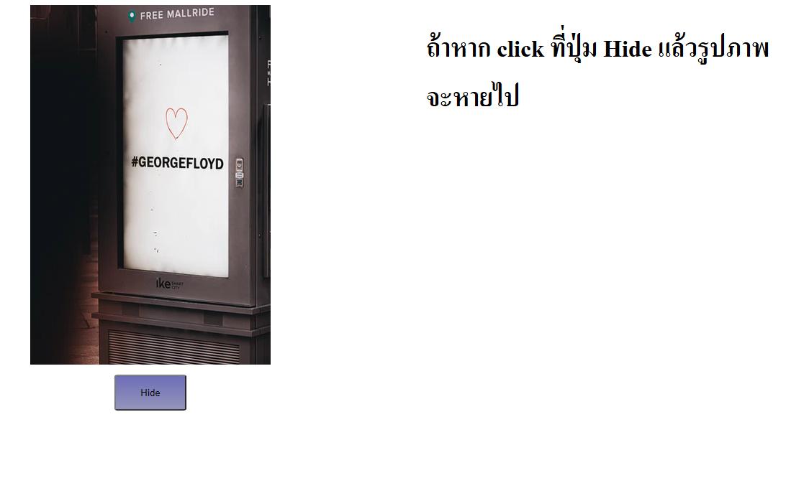

# Hide the picture

## Exercise

### The Problem

1. Have got a picture
1. Have got a button
1. They are center
1. If the user click on hide that picture hide the display.



### Example code

```html
<div class="container">
  <div class="hideThis">
    
  </div>
  <button id="hidepiceture" onclick="hidePicture()">Hide</button>
</div>

<script>
  //function declaration
  function hidePicture() {
    document.querySelector(".hideThis").style.display = "none";
  }
</script>
```
